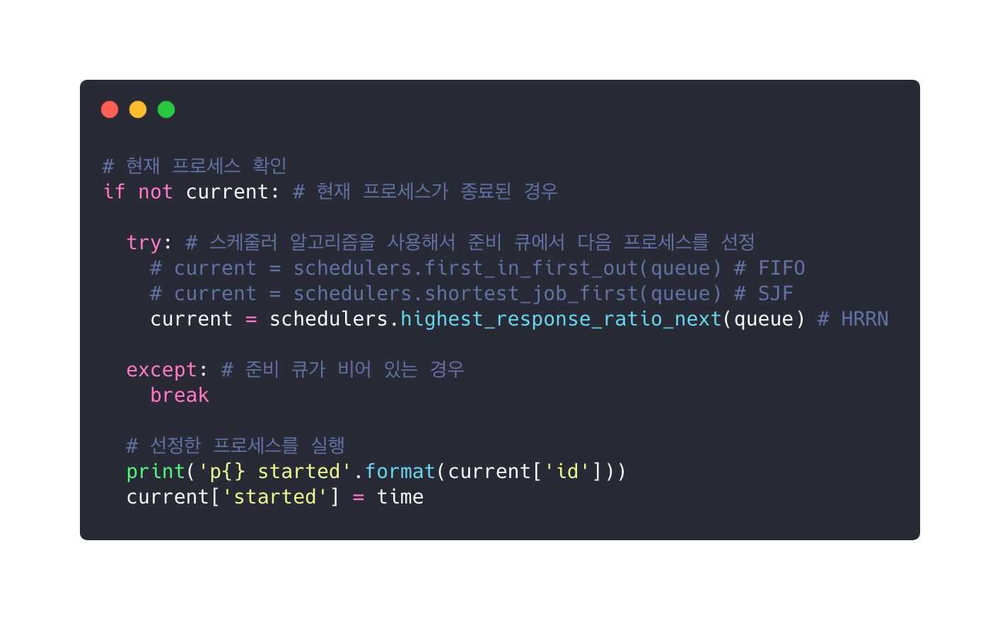
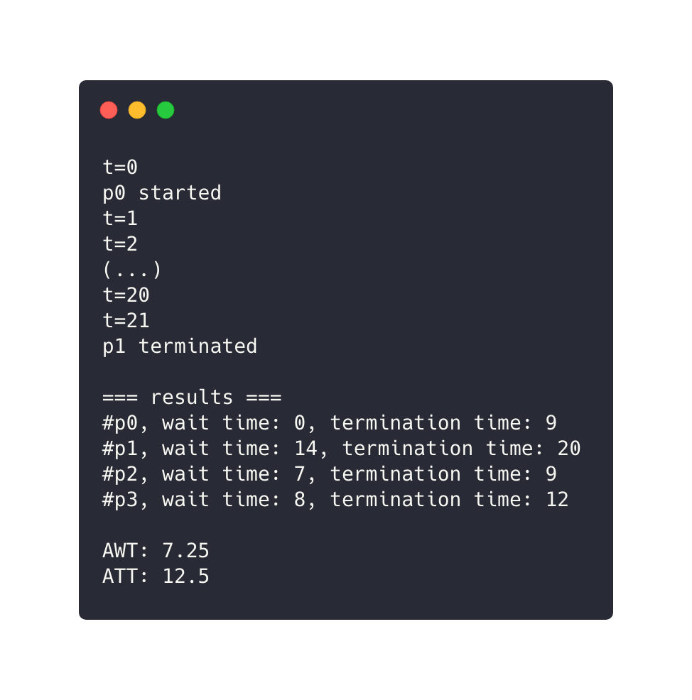
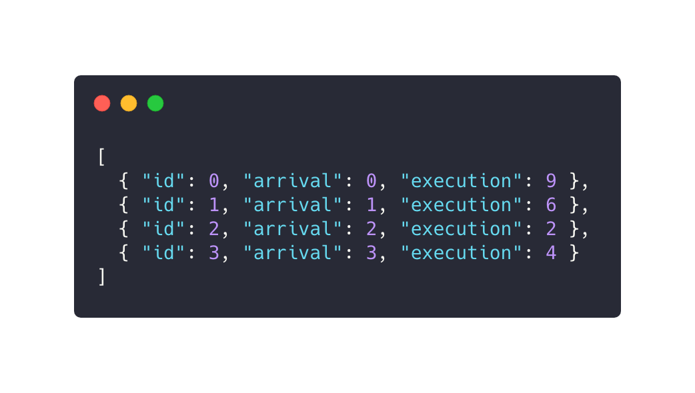

# Computer Science Process Schedulers
**컴퓨터 시스템 일반** 탐구 활동 - 프로세스 스케줄러 구현하기

1. [보고서](#Abstract)
2. [실행 및 결과](#Usage)
   1. [FIFO 알고리즘](#FIFO-First-In-First-Out)
   2. [SJF 알고리즘](#SJF-Shortest-Job-First)
   2. [HRRN 알고리즘](#HRRN-Highest-Response-Ratio-Next)

## Abstract
> 컴퓨터 일반 수업 때 배운 프로세스 스케줄러를, 제가 평소 활발하게 연구 및 프로젝트를 진행하고 있는 분야인 프로그래밍으로 만들어 보면 어떨까 하여 Python으로 구현했습니다.



> 실제로 준비 큐, 프로세스 도착/종료/선정을 구현했고, 파일 schedulers.py에서 대표적인 스케줄러 알고리즘인 FIFO(준비 큐에서 들어온 순서대로 pop), SJF(준비 큐의 프로세스를 실행 시간 기준으로 정렬하여 선정), HRRN(준비 큐의 각 프로세스 우선순위를 계산하여 선정)을 구현했습니다.



> 프로그램을 실행하면 시간에 따라 각 프로세스의 시작(start)과 종료(termination)를 보여주며, 모든 프로세스가 종료된 뒤 각 프로세스의 대기 시간(wait time)과 반환 시간(termination time)을 출력하고 평균 대기 시간(AWT), 평균 반환 시간(ATT)을 계산해 보여줍니다.



> 프로세스 목록은 효율적인 개발과 사용을 위해서 JSON 포맷으로 파일에 저장된 것을 로딩합니다. 각각의 프로세스 오브젝트는 컴퓨터 시스템 일반 시간의 유인물에서처럼, 각각의 프로세스 번호(id), 도착 시간(arrival), 실행 시간(execution)을 가집니다.

유인물에서 제시된 표의 값대로 프로세스 목록을 만들고 각 알고리즘을 실행했을 때, 수업 시간에 계산했던 결과와 동일한 출력이 나와서 뿌듯했습니다. 실제로 스케줄러의 동작을 구현하니 각 알고리즘의 흐름에 대해서 더 쉽게 이해할 수 있었습니다. 앞으로 라운드 로빈과 같은 다른 알고리즘까지 지원하도록 만들고, vue.js 등의 자바스크립트 프론트엔드 프레임워크를 사용해 처리를 시각화해 다른 학생들이나 (곧 생길) 후배들이 프로세스 스케줄러를 더 쉽게 이해할 수 있게 할 것입니다. 

## Usage
`./process.json`에 아래와 같이 실행할 프로세스 목록을 저장합니다.

```json
[
  { "id": 0, "arrival": 0, "execution": 9 },
  { "id": 1, "arrival": 1, "execution": 6 },
  { "id": 2, "arrival": 2, "execution": 2 },
  { "id": 3, "arrival": 3, "execution": 4 }
]
```

위에서 각각 `id`는 프로세스 번호, `arrival`은 도착 시간, `execution`은 실행(처리) 시간을 뜻합니다.

| 예시 프로세스 | 도착 시간 | 실행 시간 |
| ------ | ------ | ------:|
| p0 | 0 | 9 |
| p1 | 1 | 6 |
| p2 | 2 | 2 |
| p3 | 3 | 4 |

## FIFO (First In First Out)
```
t=0
p0 started
t=1
t=2
t=3
t=4
t=5
t=6
t=7
t=8
t=9
p0 terminated
p1 started
t=10
t=11
t=12
t=13
t=14
t=15
p1 terminated
p2 started
t=16
t=17
p2 terminated
p3 started
t=18
t=19
t=20
t=21
p3 terminated

=== results ===
#p0, wait time: 0, termination time: 9
#p1, wait time: 8, termination time: 14
#p2, wait time: 13, termination time: 15
#p3, wait time: 14, termination time: 18

AWT: 8.75
ATT: 14.0
```

| 프로세스 | 대기 시간 | 반환 시간 |
| ------ | ------ | ------:|
| p0 | 0 | 9 |
| p1 | 8 | 14 |
| p2 | 13 | 15 |
| p3 | 14 | 18 |

| 평균 대기 시간 | 평균 반환 시간 |
| ------ | ------:|
| 8.75 | 14.0 |

## SJF (Shortest Job First)
```
t=0
p0 started
t=1
t=2
t=3
t=4
t=5
t=6
t=7
t=8
t=9
p0 terminated
p2 started
t=10
t=11
p2 terminated
p3 started
t=12
t=13
t=14
t=15
p3 terminated
p1 started
t=16
t=17
t=18
t=19
t=20
t=21
p1 terminated

=== results ===
#p0, wait time: 0, termination time: 9
#p1, wait time: 14, termination time: 20
#p2, wait time: 7, termination time: 9
#p3, wait time: 8, termination time: 12

AWT: 7.25
ATT: 12.5
```

| 프로세스 | 대기 시간 | 반환 시간 |
| ------ | ------ | ------:|
| p0 | 0 | 9 |
| p1 | 14 | 20 |
| p2 | 7 | 9 |
| p3 | 8 | 12 |

| 평균 대기 시간 | 평균 반환 시간 |
| ------ | ------:|
| 7.25 | 12.5 |

## HRRN (Highest Response Ratio Next)
```
t=0
p0 started
t=1
t=2
t=3
t=4
t=5
t=6
t=7
t=8
t=9
p0 terminated
p2 started
t=10
t=11
p2 terminated
p3 started
t=12
t=13
t=14
t=15
p3 terminated
p1 started
t=16
t=17
t=18
t=19
t=20
t=21
p1 terminated

=== results ===
#p0, wait time: 0, termination time: 9
#p1, wait time: 14, termination time: 20
#p2, wait time: 7, termination time: 9
#p3, wait time: 8, termination time: 12

AWT: 7.25
ATT: 12.5
```

| 프로세스 | 대기 시간 | 반환 시간 |
| ------ | ------ | ------:|
| p0 | 0 | 9 |
| p1 | 14 | 20 |
| p2 | 7 | 9 |
| p3 | 8 | 12 |

| 평균 대기 시간 | 평균 반환 시간 |
| ------ | ------:|
| 7.25 | 12.5 |
